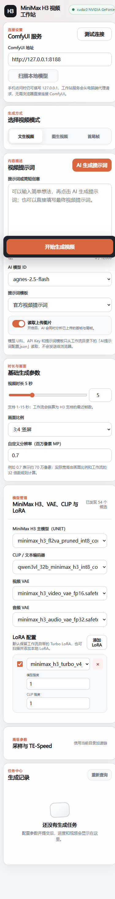

<div align="center">

# 🎬 MiniMax H3 视频工作站

**MiniMax H3 Workstation UI** — 面向本地 ComfyUI 的 MiniMax H3 一键视频生成工作站。

支持文生视频 · 图生视频 · 首尾帧 · 全能参考（图片/视频/音频）等生成模式，集成 **TE-Speed 加速**、**LoRA 管理与加速链**、**AI 提示词生成**，并内置一个轻量的 PowerShell Web 服务，一台电脑即可同时服务浏览器与手机端。

</div>

---

## 🖼️ 界面预览

<div align="center">
  
  
</div>

<div align="center"><em>左：桌面端（模型管理 / TE-Speed / 任务中心） · 右：移动端 AI 提示词界面</em></div>

---

## ✨ 功能特性

- 🎞️ **四种生成模式**：文生视频（T2V）、图生视频（I2V）、首尾帧、全能参考（图片 + 视频 + 音频多模态组合，图片最多 9 张 / 视频 3 段 / 音频 3 段，合计 12 个素材）。
- 🚀 **TE-Speed 加速**：默认接入 TE-SpeedMiniMaxH3 加速节点，支持灵活调整加速控制值、区间起点与终点。
- 🧩 **LoRA Manager 加速链**：扫描并选择本地 LoRA，普通模式与全能参考模式分别管理默认 Turbo LoRA；支持多 LoRA 叠加。
- 🤖 **AI 提示词生成**：填写一句话创意即可让 AI 模型生成结构化视频提示词（OpenAI 兼容 `/chat/completions` 接口），支持视觉模型**读取上传的首帧 / 尾帧**进行多模态分析；云端 API 与本地模型（LM Studio / Ollama 等 OpenAI 兼容服务）均可接入，且为独立服务，**不阻断视频生成**。
- ↩️ **提示词撤回**：AI 生成结果会覆盖提示词框，一键「撤回」即可恢复到生成前的输入——模型拒答时不再丢失你写的原稿。
- 🖱️ **文件拖拽上传**：图片 / 视频 / 音频直接拖入页面即可上传。首尾帧模式一次拖两张自动分配首帧与尾帧；全能参考模式混合拖入时自动按类型归类。
- 🗂️ **本地工作流 JSON**：三种基础模式分别读取当前目录下的独立 JSON 工作流，参数由服务端注入，前端无需直接构造 ComfyUI 工作流。
- 🌐 **浏览器 + 手机端**：内置 PowerShell Web 服务（默认 `http://127.0.0.1:8000`），桌面浏览器可直接访问，手机可通过局域网访问同一地址；ComfyUI 请求由服务端代理，手机端无需直连 `8188` 端口。
- 🔍 **模型扫描**：一键扫描本地 UNET / CLIP / VAE / LoRA 模型并在下拉框中选用。
- ✅ **任务中心**：生成进度实时查询，网络短暂断开也能自动恢复轮询，不会误报失败。

---

## 📁 目录结构

```
MiniMax-H3-Workstation-UI/
├── 启动工作站.bat                 # 一键启动脚本（自动申请管理员权限以支持手机访问）
├── server.ps1                     # 核心 Web 服务（HTTP 监听 + ComfyUI 代理 + AI 提示词服务）
├── index.html                     # 主界面（单页应用）
├── favicon.svg                    # 站点图标
├── assets/
│   ├── workstation.css            # 界面样式
│   └── workstation.js             # 前端逻辑
├── AI提示词配置.json               # AI 提示词服务配置（模型 / 提示词模板，空 Key 模板）
├── minimaxH3文生视频基础加速流.json     # 文生视频工作流
├── minimaxH3图生视频基础加速流.json     # 图生视频工作流
├── minimaxH3首尾帧视频基础加速流.json    # 首尾帧视频工作流
└── minimaxh3全能参考(图片+视频+音频)+ai提示词生成+加速+Lora.json  # 全能参考工作流
```

---

## 📋 环境要求

- **Windows** 系统（脚本基于 PowerShell，`启动工作站.bat` 依赖 Windows 命令）。
- 已安装并启动 **ComfyUI**（默认 `http://127.0.0.1:8188`）。
- 已就绪 MiniMax H3 相关模型（放到对应 ComfyUI 目录）：
  - 主模型（UNET）→ `models/diffusion_models`
  - CLIP / 文本编码器 → `models/clip`
  - 视频 VAE / 音频 VAE → `models/vae`
  - LoRA → `models/loras`
- 需要以下 ComfyUI 自定义节点：
  - **TE-SpeedMiniMaxH3**（加速节点，位于普通工作流与全能参考工作流中）
  - **ComfyUI-LoraManager**（LoRA 加速链）
  - **VideoHelperSuite**（仅「全能参考」模式提交视频参考时使用，用于把视频转为帧序列）
- 使用 AI 提示词功能时，需要可访问的 OpenAI 兼容接口服务与对应 **API Key**。

---

## 🚀 快速开始

1. **准备环境**：如上安装并启动 ComfyUI，放置好 MiniMax H3 模型及所需自定义节点。
2. **填写 AI 配置（可选）**：在 `AI提示词配置.json` 中填写「AI 语言模型」的 URL 与 API Key，并按需调整提示词模板。
3. **启动工作站**：双击运行 `启动工作站.bat`。
   - 脚本会自动申请管理员权限以开放局域网访问；
   - 启动后浏览器将自动打开工作台地址（默认 `http://127.0.0.1:8000/`）。
4. **连接并生成**：
   - 在「ComfyUI 服务」中确认地址为你的 ComfyUI（默认 `http://127.0.0.1:8188`），点击「测试连接」；
   - 点击「扫描本地模型」选择主模型 / CLIP / VAE / LoRA；
   - 选择生成模式、填写提示词（或点击「AI 生成提示词」自动生成）、设置时长与画面比例；
   - 点击「开始生成视频」，在右侧任务中心查看进度与成片。

> 💡 **手机访问**：手机连接与电脑同一局域网，直接访问终端显示的局域网地址（如 `http://192.168.x.x:8000/`）即可，无需在手机端填写 ComfyUI 地址（请求由电脑端服务代理）。

---

## ⚙️ 配置说明

### AI 提示词配置（`AI提示词配置.json`）

该文件用于配置网页中的「AI 生成提示词」功能，修改后重启工作站服务即可生效：

- `模型`：可配置多个模型，每个含 `id`、`url`（API 根地址或完整 `/chat/completions` 地址）、`api_key`、`supports_images`（是否支持读取图片）、`retry_count`（失败重试次数）等字段。支持任意 OpenAI 兼容服务，包括本地模型：LM Studio 填 `http://<IP>:1234/v1`，Ollama 填 `http://<IP>:11434/v1`（`api_key` 随意填写即可）。
- `提示词模板`：可配置多个系统提示词模板，例如「官方视频提示词」「动漫动作导演」「动态壁纸」等。
- 网页只会读取模型的 `id` 与模板的 `name`，**不会**把 `url` / `api_key` 暴露给浏览器。

> ⚠️ **安全提示**：本仓库内的 `AI提示词配置.json` 为空 Key 模板。**请勿**将包含真实 API Key 的配置文件提交到公网仓库。若需在本地使用真实配置，请在本地填写并妥善保管。

### 端口与环境变量

- 服务默认端口 `8000`，可通过环境变量 `WORKSTATION_PORT` 覆盖。
- ComfyUI 默认地址 `http://127.0.0.1:8188`，可在界面「ComfyUI 服务」中修改。

---

## 🏗️ 技术栈 / 架构

| 层 | 技术 |
| --- | --- |
| 前端 | 原生 HTML / CSS / JavaScript 单页应用（移动端与桌面端自适应） |
| 后端 | PowerShell `System.Net.HttpListener` HTTP 服务（无第三方依赖） |
| 视频生成 | ComfyUI + MiniMax H3 工作流（TE-Speed / LoraManager / VHS 等自定义节点） |
| AI 提示词 | OpenAI 兼容 `/chat/completions` 接口（支持视觉多模态） |

服务端负责：静态资源托管、ComfyUI 请求代理、工作流参数注入、模型扫描、任务进度轮询、视频预览代理与 AI 提示词调用。

---

## 📚 Credits / 致谢

- [ComfyUI](https://github.com/comfyanonymous/ComfyUI) —— 底层生成引擎
- MiniMax H3 模型及其社区工作流与加速节点（TE-SpeedMiniMaxH3）
- [ComfyUI-LoraManager](https://github.com/VU-OArc/ComfyUI-LoraManager) —— LoRA 管理
- VideoHelperSuite —— 参考视频转帧

---

## 📄 License

本仓库默认提供于 GitHub 公开仓库中，适用于个人学习与本地使用。请遵守所使用的模型、节点与 API 服务各自的许可与使用条款。

---

<p align="center">如果这个项目对你有帮助，欢迎 ⭐ Star 或 Fork。有问题可提 Issue。🙌</p>