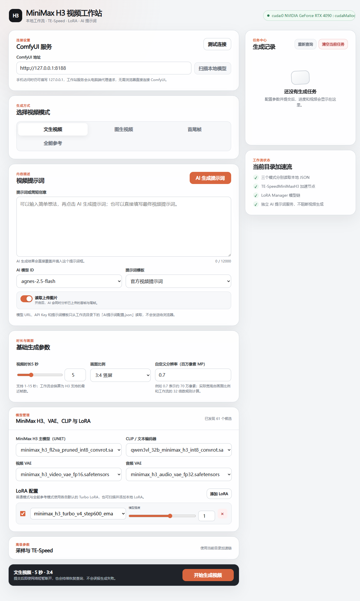

<div align="center">
有问题可以加我的QQ群：1062979770反馈，整合包三视图等等资源都在群里哦！建议使用我配置好的整合包环境使用，不然可能会在装节点和环境依赖等问题卡壳。
  
# 🎬 MiniMax H3 视频工作站

**MiniMax H3 Workstation UI** — 面向本地 ComfyUI 的 MiniMax H3 一键视频生成工作站。

支持文生视频 · 图生视频 · 首尾帧 · 全能参考（图片/视频/音频）等生成模式，集成 **TE-Speed 加速**、**LoRA 管理与加速链**、**AI 提示词生成**，并内置一个轻量的 PowerShell Web 服务，一台电脑即可同时服务浏览器与手机端。

</div>

---

## 🖼️ 界面预览

<div align="center">
  
</div>

<div align="center"><em>左：桌面端（模型管理 / TE-Speed / 任务中心） · 右：移动端 AI 提示词界面</em></div>

---

## ✨ 功能特性

- 🎞️ **四种生成模式**：文生视频（T2V）、图生视频（I2V）、首尾帧、全能参考（图片 + 视频 + 音频多模态组合，图片最多 9 张 / 视频 3 段 / 音频 3 段，合计 12 个素材）。
- 🚀 **TE-Speed 加速**：默认接入 TE-SpeedMiniMaxH3 加速节点，支持灵活调整加速控制值、区间起点与终点。
- 🧩 **LoRA Manager 加速链**：扫描并选择本地 LoRA，普通模式与全能参考模式分别管理默认 Turbo LoRA；支持多 LoRA 叠加。
- 🤖 **AI 提示词生成**：填写一句话创意即可让 AI 模型生成结构化视频提示词（OpenAI 兼容 `/chat/completions` 接口），支持视觉模型**读取上传的首帧 / 尾帧**进行多模态分析；云端 API 与本地模型（LM Studio / Ollama 等 OpenAI 兼容服务）均可接入，且为独立服务，**不阻断视频生成**。
- ↩️ **提示词撤回**：AI 生成结果会覆盖提示词框，一键「撤回」即可恢复到生成前的输入——模型拒答时不再丢失你写的原稿。
- 🖱️ **文件拖拽上传**：图片 / 视频 / 音频直接拖入页面即可上传。首尾帧模式一次拖两张自动分配首帧与尾帧；全能参考模式混合拖入时自动按类型归类。
- 🧩 **可选节点自动降级（兼容性）**：RTX 视频放大、TE-Speed、LoRA Manager 都属于「可选」节点。工作站在连接时会探测 ComfyUI 实际装了哪些节点，**缺哪个就自动跳过对应环节并继续出片**——没装 RTX 节点包时按原分辨率输出、没装 TE-Speed 时跳过加速、没装 LoRA Manager 时跳过 LoRA，同时把原因常驻显示在「高级参数」里。不会因为缺少非关键节点而整单失败。
- 💾 **四种模式统一使用 ComfyUI 官方保存节点**：文生 / 图生 / 首尾帧与全能参考的输出节点都是 ComfyUI **内置**的 `SaveVideo`，不依赖任何第三方节点即可出片。
- 🔄 **检查更新与一键更新**：自动检测 GitHub 仓库是否有新版本（6 小时节流，也可点右上角「检查更新」手动检查），发现新版本弹出横幅；一键更新自动下载、替换文件并重启服务，`AI提示词配置.json` 等个人配置自动保留。
- 🧹 **自动清理显存 + 手动一键清理**：「高级参数」内置滑动开关（默认开启）。**视频生成完成后**，网页会先确认 ComfyUI 队列是否空闲：空闲就调用官方 `/free` 接口卸载模型释放显存；队列里还有任务在跑或排队则自动跳过，等最后一个任务结束后再清理——既不打断连续排队生成，也规避了 comfy-aimdo 动态显存加载下 `hostbuf_file_reader_read failed` 的问题。旁边另有「立即清理显存」按钮，可随时手动释放显存（队列繁忙时会拒绝并提示，不打断生成）。
- 🗂️ **本地工作流 JSON**：三种基础模式分别读取当前目录下的独立 JSON 工作流，参数由服务端注入，前端无需直接构造 ComfyUI 工作流。
- 🌐 **浏览器 + 手机端**：内置 PowerShell Web 服务（默认 `http://127.0.0.1:8000`），桌面浏览器可直接访问，手机可通过局域网访问同一地址；ComfyUI 请求由服务端代理，手机端无需直连 `8188` 端口。
- 🔍 **模型扫描**：一键扫描本地 UNET / CLIP / VAE / LoRA 模型并在下拉框中选用。
- ✅ **任务中心**：生成进度实时查询，网络短暂断开也能自动恢复轮询，不会误报失败。

---

## 📁 目录结构

```
MiniMax-H3-Workstation-UI/
├── 启动工作站.bat                 # 一键启动脚本（自动申请管理员权限以支持手机访问）
├── server.ps1                     # 核心 Web 服务（HTTP 监听 + ComfyUI 代理 + AI 提示词服务）
├── index.html                     # 主界面（单页应用）
├── favicon.svg                    # 站点图标
├── assets/
│   ├── workstation.css            # 界面样式
│   └── workstation.js             # 前端逻辑
├── AI提示词配置.example.json       # AI 提示词服务配置模板（空 Key，复制为 AI提示词配置.json 后填写）
├── AI提示词配置.json               # 本地实际生效的配置（含真实 Key，已加入 .gitignore，不随仓库分发）
├── 更新配置.json                  # 更新检测配置（GitHub 仓库 / 当前版本 / 更新时保留清单）
├── .gitignore                     # 忽略本地真实配置、记忆目录与审查产物
├── minimaxH3文生视频基础加速流.json     # 文生视频工作流
├── minimaxH3图生视频基础加速流.json     # 图生视频工作流
├── minimaxH3首尾帧视频基础加速流.json    # 首尾帧视频工作流
└── minimaxh3全能参考(图片+视频+音频)+ai提示词生成+加速+Lora.json  # 全能参考工作流
```

---

## 📋 环境要求

- **Windows** 系统（脚本基于 PowerShell，`启动工作站.bat` 依赖 Windows 命令）。
- 已安装并启动 **ComfyUI**（默认 `http://127.0.0.1:8188`）。**需要较新版本**（本项目在 **0.34.5** 上验证）：MiniMax H3 的主节点（`MiniMaxH3ImageToVideo` / `MiniMaxH3ReferenceToVideo`）以及 `ResolutionSelector`、`ComfyMathExpression`、`PrimitiveFloat` 等由 ComfyUI **内置**（`comfy_extras`）提供，版本过旧时提交会直接报 `missing_node_type`。
- 已就绪 MiniMax H3 相关模型（放到对应 ComfyUI 目录）：
  - 主模型（UNET）→ `models/diffusion_models`
  - CLIP / 文本编码器 → `models/clip`
  - 视频 VAE / 音频 VAE → `models/vae`
  - LoRA → `models/loras`
- 另需以下 ComfyUI 自定义节点（MiniMax H3 主节点由 ComfyUI 内置提供，不在此列）：
  - **TE-SpeedMiniMaxH3**（加速节点，位于普通工作流与全能参考工作流中）
  - **ComfyUI-LoraManager**（LoRA 加速链）
  - **ComfyUI-Easy-Use**（可选。仓库自带工作流 JSON 里包含其 `easy cleanGpuUsed` 清理节点，仅在 ComfyUI 画布中直接运行这些工作流时需要；网页端提交时服务端会自动移除该节点，显存清理改走 ComfyUI 官方 `/free` 接口）
  - **VideoHelperSuite**（仅「全能参考」模式提交视频参考时使用，用于把视频转为帧序列）
- 使用 AI 提示词功能时，需要可访问的 OpenAI 兼容接口服务与对应 **API Key**。

> 💡 **关于上面这些自定义节点**：除 ComfyUI 内置节点外，其余都是**可选**的。工作站连接时会探测 ComfyUI 实际拥有的节点，缺少时自动降级（跳过 RTX 放大 / TE-Speed 加速 / LoRA）并在「高级参数」里给出提示，不会因此无法生成。只有 ComfyUI 版本过旧、缺少内置的 MiniMax H3 主节点时才会真正不可用（会明确提示需要更新 ComfyUI）。
>
> 关于保存节点：四种模式的输出节点统一使用 **ComfyUI 官方内置**的 `SaveVideo`，不需要安装任何第三方保存节点。

---

## 🚀 快速开始

1. **准备环境**：如上安装并启动 ComfyUI，放置好 MiniMax H3 模型及所需自定义节点。
2. **填写 AI 配置（可选）**：把 `AI提示词配置.example.json` 复制为 `AI提示词配置.json`，在其中填写「AI 语言模型」的 URL 与 API Key，并按需调整提示词模板（`AI提示词配置.json` 已加入 `.gitignore`，不会被误提交）。
3. **启动工作站**：双击运行 `启动工作站.bat`。
   - 脚本会自动申请管理员权限以开放局域网访问；
   - 启动后浏览器将自动打开工作台地址（默认 `http://127.0.0.1:8000/`）。
4. **连接并生成**：
   - 在「ComfyUI 服务」中确认地址为你的 ComfyUI（默认 `http://127.0.0.1:8188`），点击「测试连接」；
   - 点击「扫描本地模型」选择主模型 / CLIP / VAE / LoRA；
   - 选择生成模式、填写提示词（或点击「AI 生成提示词」自动生成）、设置时长与画面比例；
   - 点击「开始生成视频」，在右侧任务中心查看进度与成片。

> 💡 **手机访问**：手机连接与电脑同一局域网，直接访问终端显示的局域网地址（如 `http://192.168.x.x:8000/`）即可，无需在手机端填写 ComfyUI 地址（请求由电脑端服务代理）。

---

## ⚙️ 配置说明

### AI 提示词配置（`AI提示词配置.json`）

该文件用于配置网页中的「AI 生成提示词」功能，修改后重启工作站服务即可生效。首次使用请把仓库内的 `AI提示词配置.example.json` 复制为 `AI提示词配置.json`：

- `模型`：可配置多个模型，每个含 `id`、`url`（API 根地址或完整 `/chat/completions` 地址）、`api_key`、`supports_images`（是否支持读取图片）、`retry_count`（失败重试次数）等字段。支持任意 OpenAI 兼容服务，包括本地模型：LM Studio 填 `http://<IP>:1234/v1`，Ollama 填 `http://<IP>:11434/v1`（`api_key` 随意填写即可）。
- `提示词模板`：可配置多个系统提示词模板，例如「官方视频提示词」「动漫动作导演」「动态壁纸」等。
- 网页只会读取模型的 `id` 与模板的 `name`，**不会**把 `url` / `api_key` 暴露给浏览器。

> ⚠️ **安全提示**：仓库内只提供 `AI提示词配置.example.json`（空 Key 模板）；`AI提示词配置.json` 已加入 `.gitignore`，不会被提交。**请勿**把它从忽略列表里移出后提交到公网仓库。若曾把含真实 Key 的版本推到过远端，建议直接轮换这些 Key。

### 更新检测配置（`更新配置.json`）

一键更新功能以本文件为配置源，日常使用无需手动维护（更新成功后会自动改写版本号）：

- `GitHub仓库`：格式 `用户名/仓库名`，也支持填写完整 GitHub 地址；更新检测以此为源。
- `当前版本`：本地对应的提交 SHA，与仓库 main 分支最新提交比对判断是否有更新。
- `分支`：默认 `main`。
- `更新时保留的文件`：一键更新时不被覆盖的文件列表，默认保留 `AI提示词配置.json` 与 `更新配置.json`，其余文件以仓库版本为准（只增改、不删除本地多出的文件）。

### 端口与环境变量

- 服务默认端口 `8000`，可通过环境变量 `WORKSTATION_PORT` 覆盖。
- ComfyUI 默认地址 `http://127.0.0.1:8188`，可在界面「ComfyUI 服务」中修改。

---

## 🏗️ 技术栈 / 架构

| 层 | 技术 |
| --- | --- |
| 前端 | 原生 HTML / CSS / JavaScript 单页应用（移动端与桌面端自适应） |
| 后端 | PowerShell `System.Net.HttpListener` HTTP 服务（无第三方依赖） |
| 视频生成 | ComfyUI + MiniMax H3 工作流（TE-Speed / LoraManager / VHS 等自定义节点） |
| AI 提示词 | OpenAI 兼容 `/chat/completions` 接口（支持视觉多模态） |

服务端负责：静态资源托管、ComfyUI 请求代理、工作流参数注入、模型扫描、任务进度轮询、视频预览代理与 AI 提示词调用。

---

## 🕘 更新日志

### v20260912 · 复审修复（2026-09-12）

- 🚨 **修复 · 严重：装了某些第三方节点后整个工作站不可用**。ComfyUI 里存在**仅大小写不同**的两个节点名时（本机实测：`dynamicThresholdingFull` 与 `DynamicThresholdingFull`），Windows PowerShell 的 JSON 解析会因为「字典含重复键」直接抛异常。后果是**能力探测与所有模式的生成一起返回 500**，整个星球停止转动。现已改为**直接扫描原始 JSON 文本**取节点名（不再整体反序列化），3027 个节点 / 5.4MB 响应实测约 0.85 秒。
  - 如果你之前遇到过「一点生成就报错、看不出哪里错」，这就是原因。
- 🚨 **修复 · 严重：全能参考模式提交必 500（`'list' object has no attribute 'items'`）**。「孤立加载节点清理」的辅助函数返回删除计数，调用处没有丢弃返回值——PowerShell 会把它泄漏进构建函数的输出流，导致提交体的 `prompt` 字段从对象变成**数组**，ComfyUI 直接拒绝。现已补上 `| Out-Null`，并在提交前增加类型防御（构建结果异常时明确报错，不再发给 ComfyUI 换回难懂的 500）。
- 🐛 **修复 · 基础分辨率填成小数会被截断**。PowerShell 在函数作用域里计算 `[Math]::Min(4, 0.4)` 会选中整数重载并**把小数直接截断**（0.4 变 0、0.7 变 1），顶层作用域反而正常，所以很难发现。已在服务端与前端各加一层夹紧（合法范围 0.1–4，非法值回退 0.4）。
- 🐛 **修复 · 静态资源版本号不一致**：`css` / `js` 的 `?v=` 现已同步（`20260912-3`）。
- ⚡ **优化 · 减少重复探测节点表**：连续提交时不再每 60 秒重新拉一次 5MB 的 `/object_info`；网页侧同一时刻只会发一次能力探测请求。
- 💡 **文案纠正 · 「自动清理显存」实际依赖页面存活**：任务结束后的自动清理由网页在轮询到终态时发起，关掉或刷新页面就不会执行（服务端只会在你下次提交且队列空闲时补做一次）。开关说明已如实改写。
- 💡 **文案补充 · RTX 放大会同时作用于首尾帧图片**：图片会按同一倍数先放大再送入模型，更清晰但略微增加显存与耗时。开关说明已补充。
- 💡 **新提示 · 连接被安全白名单拦下时常驻显示原因**：此前只弹一条会消失的提示，现在会在「ComfyUI 地址」下方说明如何处理（需设置 `WORKSTATION_ALLOW_COMFY_HOSTS`）。

### v20260912（2026-09-12）

- ✨ **新功能 · 可选节点自动降级（兼容性）**：工作站连接 ComfyUI 后会读取一次节点表（`/object_info`，按地址缓存 60 秒），据此判断哪些「可选节点」存在，并在构建工作流时做降级：
  - 缺 `RTXVideoSuperResolution` → 跳过 RTX 放大，按原分辨率输出；
  - 缺 `TE-SpeedMiniMaxH3` → 把模型链直接接到采样器的 guider，跳过加速（生成变慢，结果正常）；
  - 缺 `ComfyUI-Lora-Manager` → 绕过 LoRA 节点，不加载 LoRA；
  - 这些情况下**都会照常出片**，并把原因随提交结果一起返回、常驻显示在「高级参数」里，同时弹一条简短提示。
- 💾 **「全能参考」改用官方保存节点**：该模式的输出节点原本是第三方的 `CleanMetadataSaveVideo`（来自 ComfyUI-MetadataCleaner），没装这个包时整个模式不可用（`missing_node_type`）。现已改为 ComfyUI **官方内置**的 `SaveVideo`，与文生 / 图生 / 首尾帧一致——**四种模式现在都不依赖任何第三方保存节点**，也不需要再装 ComfyUI-MetadataCleaner。副作用是不再自动清除视频元数据。
- 🔍 **新功能 · 兼容性提示与 `/api/capabilities`**：网页在「测试连接」时会强制重新探测节点（`?fresh=1`，刚装完节点包不用等缓存过期）：RTX 开关在缺节点时直接禁用并取消勾选，其它缺失项列在「高级参数」的兼容性提示里。
- 🐛 **修复 · 缺少 RTX 节点时不再阻断生成**：此前开启 RTX 放大但未安装节点包会直接报错、整单失败；现在只跳过放大。
- 🔧 关键节点（`SaveVideo` / `MiniMaxH3ImageToVideo` / `MiniMaxH3ReferenceToVideo` / `ResolutionSelector` / `ComfyMathExpression` / `CreateVideo`）缺失时会明确点名并提示更新 ComfyUI，而不是抛出一句看不懂的报错。

### v20260911 · 修复补充（2026-09-11）

- 🐛 **修复：全能参考的时长换算与基础三模式不一致**。基础三模式提交时会把节点表达式改成「四舍五入到最近的 5+17n 帧」，而全能参考一直在用工作流 JSON 里烘焙的旧公式「向上取整到下一个 5+17n」，同一个秒数最多差 17 帧（0.71 秒）——例如选 6 秒，文生视频出 141 帧（5.88 秒）、全能参考出 158 帧（6.58 秒）。现在两条链路共用同一份公式，并把参考视频的取帧数（`frame_load_cap`）一起对齐。
- 🐛 **修复：AI 模型 / 提示词模板的选择每次刷新都被重置回默认值**。页面初始化时 `loadStoredState()` 会先把设置写回本地存储，而那时两个 AI 下拉还没拿到配置、只有占位项，于是已保存的选择被覆盖成空串。现在在配置加载完成前会保留原值。
- 🐛 **修复：直连 API 可提交超出 15 秒的时长**。基础三模式内部会把时长夹紧到 1-15 秒，全能参考却是原样写入；又因为 `length` 是一条连线，ComfyUI 的校验期看不到它的数值，超大时长会直接入队。现在两种模式都做同样的夹紧。
- 🔒 **安全：静态资源改为扩展名白名单**。此前服务会托管项目目录下的任意文件，同网段设备只要直接请求文件名，就能下载 `AI提示词配置.json`（含真实 API Key）、`server.ps1`（服务端源码）与工作流 JSON。现在只放行 `html/js/css/svg/图片/字体`，其余一律回退首页。
- 🔒 **安全：`/api/free` 只允许 POST**。此前同时接受 GET，任何网页只要放一个 ``，用户打开页面时模型就会被卸载。
- 🔒 **安全：ComfyUI 地址增加白名单**。此前只校验 `http://` 前缀，等于一台可被任意网页驱动探测/请求内网的服务端跳板。现在默认只允许本机与私有网段；需要连接其它主机时用环境变量 `WORKSTATION_ALLOW_COMFY_HOSTS=主机1,主机2` 显式放开。
- 🔒 **安全：写接口增加同源校验**。`/api/generate`、`/api/upload`、`/api/free`、`/api/ai-prompt`、`/api/apply-update` 现在会拒绝 Origin 与服务地址不一致的跨站请求（不带 Origin 的命令行/脚本调用不受影响）。
- 🔧 **加固**：请求体上限改为「读取前」判断（此前是读完整个 body 才检查，等于没防住）；静态文件的路径校验补上结尾分隔符并改为不区分大小写；`WORKSTATION_PORT` 填非法值时改为提示并回退 8000，而不是直接脚本报错退出。
- 🔧 **整理**：移除两个从未被调用的函数；`AI提示词配置.json` 规范化为合法 JSON（原文件在「优化提示词-建议尝试」模板里含裸换行，只有 PowerShell 能容忍，其它工具无法解析）。
- 📝 **配置变更**：仓库改为提供 `AI提示词配置.example.json`（空 Key 模板），真实的 `AI提示词配置.json` 与 `.workbuddy/` 已加入 `.gitignore`，避免误提交真实 Key。

### v20260911（2026-09-11）

- 🐛 **修复：连续排队生成基本必失败**。此前「自动清理显存」由工作流内置的 `easy cleanGpuUsed` 节点在推理流程末尾执行，而 ComfyUI 会立刻接着执行队列里的下一个任务，下一个任务加载模型时正好撞上刚被清掉的 comfy-aimdo 页缓存，于是读取权重失败。现改为**任务边界清理**：提交任务前先查 ComfyUI 队列，完全空闲才调用官方 `/free` 接口卸载模型释放显存，清理时机与排队执行彻底解耦；工作流内不再放入任何清理节点（服务端提交时统一移除 / 不注入）。
- ✨ **新功能 · 立即清理显存按钮**：「高级参数」新增按钮，随时手动卸载模型释放显存，与在 ComfyUI 界面点「清理显存」等效；队列有任务在跑或排队时会拒绝并给出提示，不会打断生成。
- 🔧 开关文案同步更新为「自动清理显存」，并说明「队列繁忙时自动跳过」的行为。
- 🔧 **调整 · 清理时机改回「生成完成后」**：上一版把清理放在「提交任务前」，结果生成完视频后显存迟迟不释放，观感上像没生效。现改为任务进入终态时由网页触发 `/api/free?soft=1`，服务端仍先判断队列——空闲才清，还有任务排着就静默跳过。清理成功时会在服务窗口打印一行 `[显存]` 日志，方便确认是否真的执行了。

### v20260909（2026-09-09）

- ✨ **新功能 · RTX 视频放大**：「高级参数」新增开关与放大倍数选择（1–4 倍，默认 2 倍）。开启后视频合成完成时用 NVIDIA RTX Video Super Resolution 对画面帧做超分放大，音频与帧率原样保留；需要 RTX 显卡并安装 ComfyUI 官方 RTX Video 节点包，未安装时提交会给出明确提示。开启后建议把基础分辨率（百万像素）调低到 0.5 左右，速度更快、等效清晰度更高。
- 🐛 **修复：关闭「自动清理显存」时保存节点悬空**。基础三模式关闭清理开关会移除 `easy cleanGpuUsed` 节点，但保存视频节点仍指向它导致工作流失效；现会同时把保存节点接回 CreateVideo。
- 🐛 **修复：基础三模式工作流内置显存清理节点**。恢复 `easy cleanGpuUsed` 内置于工作流（接在 CreateVideo 之后），「生成后自动清理显存」开关恢复为控制该节点：开启保留、关闭移除；全能参考模式开启时依旧动态注入。
- 🔧 **改进 · AI 提示词配置**：内置多组云端与本地（LM Studio）模型配置、新增动态壁纸等提示词模板；`max_tokens` 上限提升至 16384。

### v20260903（2026-09-03）

- 🐛 **修复：连续生成时 `hostbuf_file_reader_read failed`**。工作流内的 `easy cleanGpuUsed` 清理节点会在执行中途清显存，破坏 comfy-aimdo（动态显存加载）的页缓存状态，导致下一次生成读取模型权重失败。现改为：提交时始终移除该节点，由网页在**视频生成结束且队列空闲后**调用 ComfyUI 官方 `/free` 接口清理（unload_models + free_memory）——与在 ComfyUI 界面手动清理显存完全等效的时机与动作。
- 「生成后自动清理显存」开关注义同步更新：开启即启用上述任务边界清理，连续批量生成时自动跳过，避免中途卸载模型。

### v20260902（2026-09-02）

- ✨ **新功能 · 检查更新与一键更新**：页面自动检测本仓库 main 分支最新提交，发现新版本在顶部弹出横幅；点击「一键更新」自动下载、替换文件并重启服务，页面随后自动刷新。更新请求仅访问 GitHub 官方域名（白名单 + 重定向逐跳校验），`AI提示词配置.json` 等个人文件自动保留。
- ✨ **新功能 · 生成后自动清理显存**：「高级参数」新增滑动开关（默认开启），控制 `easy cleanGpuUsed` 显存清理节点；文生 / 图生 / 首尾帧使用工作流内置节点，全能参考模式按需动态注入。
- 🔧 **改进**：HTML 响应禁用缓存，更新后刷新即取新版；服务窗口固定标题「MiniMax H3 工作站服务」；端口绑定失败自动重试 3 次。

---

## 📚 Credits / 致谢

- [ComfyUI](https://github.com/comfyanonymous/ComfyUI) —— 底层生成引擎
- MiniMax H3 模型及其社区工作流与加速节点（TE-SpeedMiniMaxH3）
- [ComfyUI-LoraManager](https://github.com/VU-OArc/ComfyUI-LoraManager) —— LoRA 管理
- VideoHelperSuite —— 参考视频转帧

---

## 📄 License

本仓库默认提供于 GitHub 公开仓库中，适用于个人学习与本地使用。请遵守所使用的模型、节点与 API 服务各自的许可与使用条款。

---

<p align="center">如果这个项目对你有帮助，欢迎 ⭐ Star 或 Fork。有问题可提 Issue。🙌</p>
